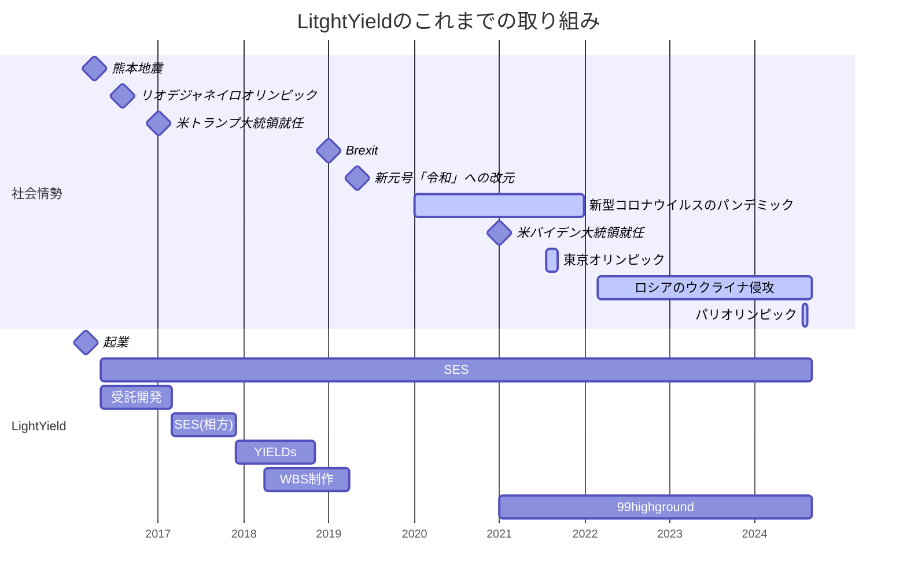

```mermaid
gantt
    title LitghtYieldのこれまでの取り組み
    dateFormat  YYYY-MM
    axisFormat  %Y

    section 社会情勢
    熊本地震: milestone, 2016-04-01, 1d
    リオデジャネイロオリンピック: milestone, 2016-08, 1d
    米トランプ大統領就任: milestone, 2017-01-01, 1d
    Brexit: milestone, 2019-01, 1d
    新元号「令和」への改元: milestone, 2019-05-01, 1d
    新型コロナウイルスのパンデミック: active, 2020-01-01, 730d
    米バイデン大統領就任: milestone, 2021-01-01, 1d
    東京オリンピック: active, 2021-07-23, 45d
    ロシアのウクライナ侵攻: active, 2022-02-24, 2024-09
    パリオリンピック: active, 2024-07-26, 17d

    section LightYield
    起業 :milestone, 2016-02-25, 1d
    SES :a1, 2016-05, 2024-09
    受託開発 :b1, 2016-05, 2017-03
    SES(相方) :c1, after b1, 2017-12
    YIELDs :d1, after c1, 2018-11
    WBS制作 :e1, 2018-04, 2019-04
    99highground :f1, 2021-01, 2024-09
```
